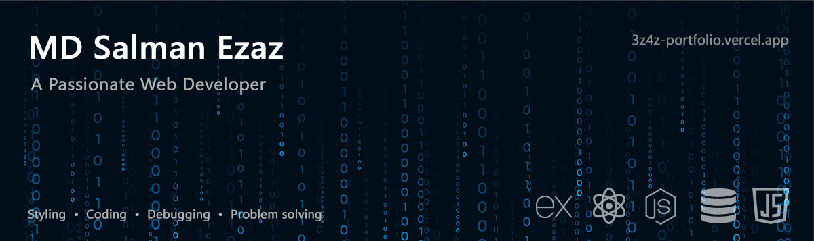

## About Me

I am **Md. Salman Ezaz**. I am a Web Developer. I build modern, responsive, and user-friendly web applications using MERN stack.I am very passionate about UI/UX, animations, and creating smooth digital experiences.

- Expert in MERN stack based web development
- Focused on full-stack engineering & clean UI
- Love building reusable, scalable components
- Designer who codes — crafting UI + logic together
- Always stay updated to latest web techs and UI tools

## Tech Stack

#### **Frontend**

  <!-- 
  
  
  
  
  
  
  
  
  
  
  
  
   -->

#### **Backend**

  <!-- 
  
  
   -->

#### **Database**

  <!-- 
   -->

#### **Version Control & Tools**

  <!-- 
  
  
   -->

#### **Others**

  <!-- 
  
  
  
   -->

#### **Design & UI Tools**

  <!-- 
  
  
   -->

#### **Other Skills**

  <!-- 
   -->

## Featured Projects

### **Personal Portfolio**

A modern portfolio built with React, Tailwind, Flowbite, and tsParticles.

### **Zap Shift**

Complete MERN stack project that offers a curated collection of tools, guides, and assets for developing robust parcel management systems.

### **Plate Share**

A MERN stack based project that lets share our foods specially leftovers around the society to lower the food waste and increase social bonding.

## GitHub Stats

  
  

## Connect With Me

- **Portfolio:** [3z4z Portfolio](https://3z4z-portfolio.vercel.app/)
- **Email:** [md.salmanezaz@gmail.com](https://mail.google.com/mail/u/0/?view=cm&fs=1&to=mdsalmanezaz@gmail.com)
- **YouTube:** [Nephilim’s Edge](https://www.youtube.com/@NephilimsEdge)
- **LinkedIn:** [Md. Salman Ezaz](https://www.linkedin.com/in/md-salmanezaz)
- **Whatsapp:** [01632095012](https://wa.me/01632095012)
- **Facebook:** [Md. Salman Ezaz](https://fb.me/sakib.salmanezaz.1)

## Fun Fact

I break things just to rebuild them better 😁
